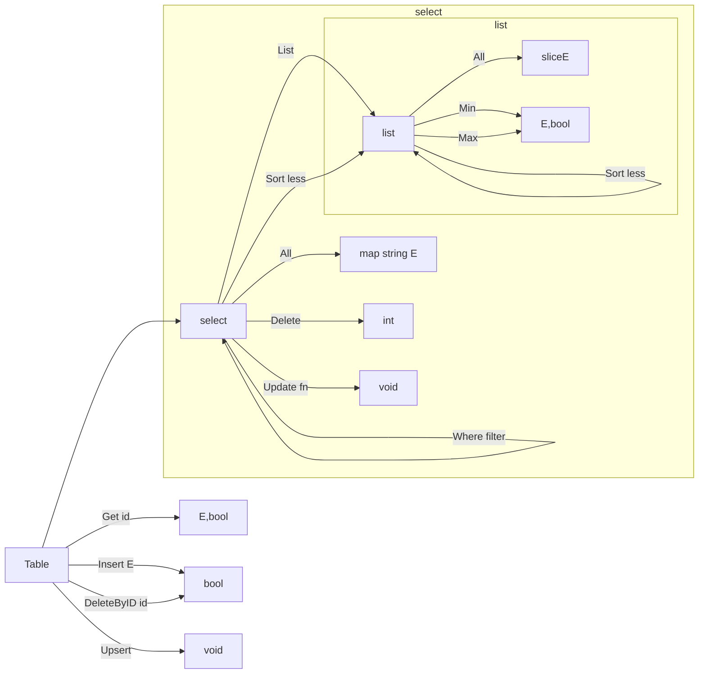

[![GoDoc][doc-img]][doc]

# simpdb

## Example usage
```go
import "github.com/rprtr258/simpdb"

type User struct {
    Name   string `json:"name"`
    Gender bool `json:"gender"`
    Age    int `json:"age"`
}

// ID - get user ID. Must be unique among all users.
func (u User) ID() string {
    return u.Name
}

func main() {
    db := simpdb.New("db")

    users, _ := simpdb.GetTable[User](db, "users", simpdb.TableConfig{})
    defer users.Close()

    // get all users as map name -> user
    users := users.All()

    // get all users as list sorted by name
    users := users.List().All()

    // get user by id
    user, ok := users.Get("Harry")

    // get all male users
    males := users.
        Where(func(_ string, u User) bool {
            return u.Gender
        }).
        All()

    // insert new user, if not already exists
    didInsert := users.Insert(User{
        Name: "Harry",
        Gender: true,
        Age: 20,
    })

    // insert new (update if already exist) user
    users.Upsert(User{
        Name: "Hermione",
        Gender: false,
        Age: 19,
    })

    // delete user by id
    didDelete := users.DeleteByID("Hermione")

    // delete all females
    femalesCount := users.
        Where(func(_ string, u User) bool {
            return !u.Gender
        }).
        Delete()

    // male users sorted by age
    wizards := users.
        Where(func(_ string, u User) bool {
            return u.Gender
        }).
        Sort(func(u1, u2 User) bool {
            return u1.Age < u2.Age
        }).
        All()

    // most elder woman
    macGonagall, ok := users.
        Where(func(_ string, u User) bool {
            return !u.Gender
        }).
        Sort(func(u1, u2 User) bool {
            return u1.Age < u2.Age
        }).
        Max()

    // make everyone female
    users.
        Update(func(u User) User {
            u.Gender = false
            return u
        })

    // update single person
    users.
        Where(func(id string, _ User) bool {
            return id == "Harry"
        }).
        Update(func(u User) User {
            u.Gender = false
            return u
        })
    // or
    user, ok := users.Get("Harry")
    user.Gender = false
    users.Upsert(user)
}
```

## Method chaining



[doc-img]: https://pkg.go.dev/badge/github.com/rprtr258/simpdb
[doc]: https://pkg.go.dev/github.com/rprtr258/simpdb
