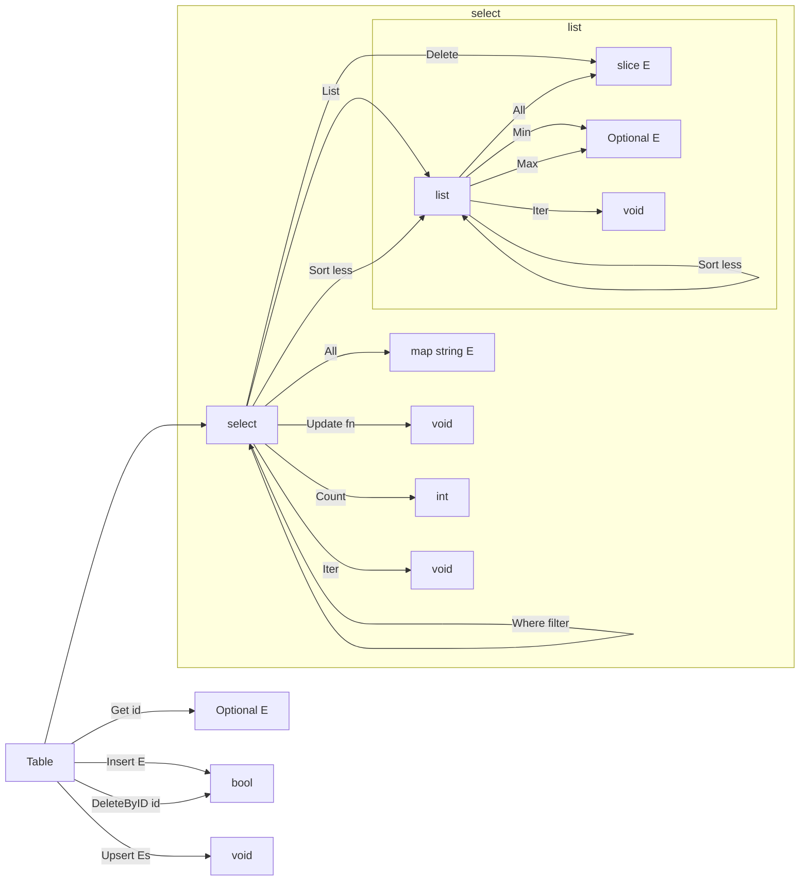

[![GoDoc][doc-img]][doc]

# simpdb

## Example usage
See [db_test.go](./db_test.go) for example usage.

## Method chaining

[doc-img]: https://pkg.go.dev/badge/github.com/rprtr258/simpdb
[doc]: https://pkg.go.dev/github.com/rprtr258/simpdb
